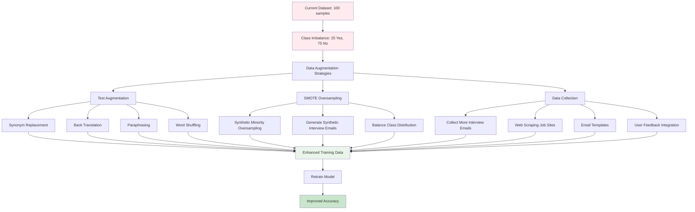
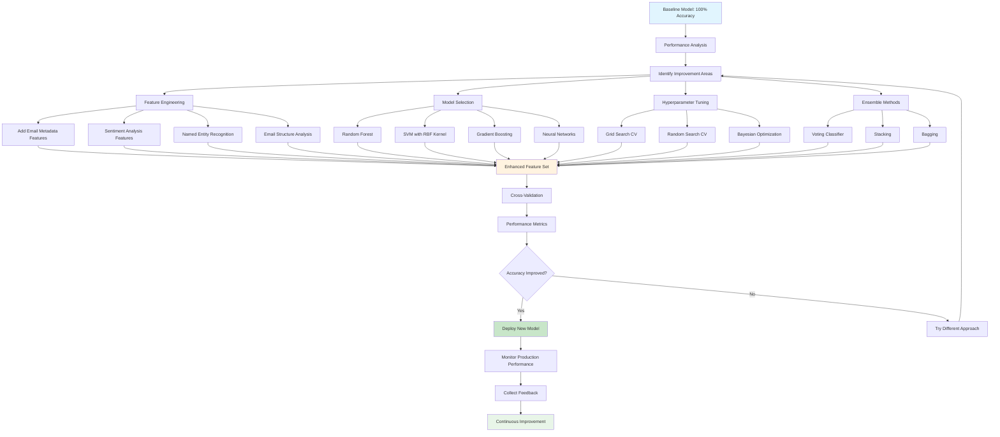

# Email Interview Classification Service

## Overview

This is a lightweight service for classifying emails to determine if they are interview-related or not. The service uses machine learning to train from CSV data and provides a REST API for predictions.

## Requirements and Constraints

### Must-haves
- ✅ **Training step**: A command to train the model from CSV and save results
- ✅ **Web service**: REST API with FastAPI to make predictions
- ✅ **Local only**: No online AI or hosted services (OpenAI, DeepSeek, etc.)

### Technical Constraints
- Python-based solution
- Use local machine learning libraries (scikit-learn)
- Model saved and loaded from local storage

## Data Analysis

### Training Dataset
- **File**: `data/Interview_vs_Non-Interview_Training_Emails__100_rows_.csv`
- **Size**: 100 samples + 1 header row
- **Columns**: 
  - `Body`: Email content (string)
  - `is_interview`: Label (Yes/No)

### Data Distribution
- **Interview emails (Yes)**: 25 samples (25%)
- **Non-interview emails (No)**: 75 samples (75%)
- **Imbalanced dataset**: Requires class imbalance handling

### Email Types in Dataset

#### Interview emails (Yes) - 25 samples
- Phone/video interview invitation emails
- Interview scheduling emails
- Emails with scheduler links (Calendly, Greenhouse, Lever)
- Technical interview emails
- Panel interview emails

**Key features**: schedule, interview, phone screen, video call, meet, calendar, slot, booking, recruiter

#### Non-interview emails (No) - 75 samples
1. **Security codes (18 samples)**: OTP, verification codes, 2FA
2. **Email verification (20 samples)**: Email authentication, activation links
3. **Application confirmations (22 samples)**: Application received confirmations
4. **Rejection emails (15 samples)**: Candidate rejection emails

**Key features**: code, verification, confirm, received, review, unfortunately, decided not to proceed

## System Architecture

### 1. Training Component
```
python scripts/train.py data/Interview_vs_Non-Interview_Training_Emails__100_rows_.csv
```

**Input**: CSV file
**Output**: Trained model saved to `models/` directory
**Process**:
1. Load and preprocess data
2. Text feature extraction (TF-IDF or Count Vectorizer)
3. Train classification model (Random Forest, SVM, or Logistic Regression)
4. Handle class imbalance (SMOTE, class weights)
5. Cross-validation for evaluation
6. Save model and vectorizer

### 2. Web Service Component

**Framework**: FastAPI (modern, async, auto-docs)
**Port**: 8000 (default)

**Startup process**:
1. Load configuration settings
2. Setup logging system
3. Initialize FastAPI app with middleware
4. Load trained model from `models/` directory
5. Start server

## API Specification

### Endpoint
```
POST /v1/predict
```

### Request Format
```json
{
  "email_body": "We'd love to schedule a 30-minute video conversation to learn more about your experience..."
}
```

### Response Format
```json
{
  "is_interview": "Yes",
  "confidence": 0.85
}
```

### Error Responses
```json
{
  "error": "Model not found. Please run training first.",
  "code": 500
}
```

```json
{
  "error": "Invalid request format. Missing 'email_body' field.",
  "code": 400
}
```

## Machine Learning Approach

### Training Flow

```mermaid
flowchart TD
    A[Start Training] --> B[Load CSV Data]
    B --> C[Validate Data Format]
    C --> D[Check Required Columns: Body, is_interview]
    D --> E[Remove Empty Values]
    E --> F[Preprocess Text Data]
    
    F --> G[TextPreprocessor]
    G --> H[Convert to Lowercase]
    H --> I[Remove Special Characters]
    I --> J[Remove Extra Whitespaces]
    J --> K[Convert Labels: Yes=1, No=0]
    
    K --> L[Split Data: Train/Test 80/20]
    L --> M[Create TF-IDF Vectorizer]
    M --> N[Configure Vectorizer Parameters]
    N --> O[max_features: 5000<br/>ngram_range: 1,2<br/>min_df: 2<br/>max_df: 0.95<br/>stop_words: english]
    
    O --> P[Fit Vectorizer on Training Data]
    P --> Q[Transform Training & Test Data]
    Q --> R{Use SMOTE?}
    
    R -->|Yes| S[Apply SMOTE Oversampling]
    R -->|No| T[Train Logistic Regression Model]
    S --> T
    
    T --> U[Model Configuration:<br/>class_weight: balanced<br/>max_iter: 1000<br/>C: 1.0]
    U --> V[Fit Model on Training Data]
    
    V --> W[Evaluate Model Performance]
    W --> X[Calculate Metrics:<br/>Accuracy, Precision, Recall, F1]
    X --> Y[Generate Confusion Matrix]
    Y --> Z[Perform 5-Fold Cross Validation]
    
    Z --> AA[Save Model & Metadata]
    AA --> BB[Save classifier.pkl]
    BB --> CC[Save vectorizer.pkl]
    CC --> DD[Save metadata.json]
    
    DD --> EE[Training Complete]
    
    style A fill:#e1f5fe
    style EE fill:#c8e6c9
    style T fill:#fff3e0
    style W fill:#f3e5f5
    style AA fill:#e8f5e8
```



### Text Preprocessing
1. **Lowercase conversion**
2. **Remove special characters** (keep alphanumeric and spaces)
3. **Remove extra whitespaces**
4. **Optional**: Remove common stop words

### Feature Extraction
**TF-IDF Vectorizer**:
- Max features: 5000
- N-gram range: (1, 2) - unigrams and bigrams
- Min document frequency: 2
- Remove English stop words

### Model Selection
**Priority for testing**:
1. **Logistic Regression** with class weights
2. **Random Forest** with balanced class weights
3. **SVM** with RBF kernel

### Class Imbalance Handling
- **Class weights**: Automatically calculate balanced weights
- **Alternative**: SMOTE oversampling for minority class

### Model Evaluation
- **Cross-validation**: 5-fold CV
- **Metrics**: Precision, Recall, F1-score for both classes
- **Focus**: High recall for interview class (avoid missing interview emails)

### Data Augmentation Strategy for Improved Accuracy



### Model Performance Optimization Pipeline



## Project Structure

```
email-classification/
├── README.md                               # This documentation
├── TECHNICAL_SPEC.md                       # Technical specification
├── PROJECT_STRUCTURE.md                    # Detailed project structure
├── requirements.txt                        # Python dependencies
├── .gitignore                             # Git ignore file
├── .env.example                           # Environment variables template
│
├── data/                                  # Training data
│   └── Interview_vs_Non-Interview_Training_Emails__100_rows_.csv
│
├── models/                                # Trained models (generated)
│   ├── classifier.pkl                     # Trained classifier
│   ├── vectorizer.pkl                     # TF-IDF vectorizer
│   └── metadata.json                      # Model metadata
│
├── app/                                   # Main application code (FastAPI best practices)
│   ├── __init__.py
│   ├── main.py                            # FastAPI app entry point
│   ├── api/
│   │   ├── __init__.py
│   │   ├── endpoints/
│   │   │   ├── __init__.py
│   │   │   └── predictions.py             # Prediction endpoints
│   │   └── dependencies.py                # Shared dependencies
│   ├── core/
│   │   ├── __init__.py
│   │   ├── config.py                      # Configuration settings
│   │   └── security.py                    # Security utilities
│   ├── models/
│   │   ├── __init__.py
│   │   └── ml_model.py                    # ML model class
│   ├── schemas/
│   │   ├── __init__.py
│   │   ├── prediction.py                  # Request/Response schemas
│   │   └── health.py                      # Health check schemas
│   ├── services/
│   │   ├── __init__.py
│   │   ├── preprocessing.py               # Text preprocessing
│   │   └── prediction_service.py          # Business logic
│   └── utils/
│       ├── __init__.py
│       └── helpers.py                     # Utility functions
│
├── scripts/                               # Utility scripts
│   ├── train.py                          # Main training script
│   ├── evaluate.py                       # Model evaluation script
│   └── test_api.py                       # API testing script
│
├── tests/                                 # Unit and integration tests
│   ├── __init__.py
│   ├── conftest.py                       # Pytest configuration
│   ├── test_preprocessing.py             # Preprocessing tests
│   ├── test_model.py                     # Model tests
│   ├── test_api.py                       # API tests
│   └── test_services/                    # Service layer tests
│       ├── __init__.py
│       └── test_prediction_service.py
│
├── logs/                                  # Application logs
│   ├── app.log                           # General application logs
│   └── error.log                         # Error logs
│
├── Dockerfile                             # Docker configuration
├── docker-compose.yml                     # Docker compose for development
└── .github/                              # GitHub workflows (optional)
    └── workflows/
        └── ci.yml                        # CI/CD pipeline
```

## Dependencies

### Core Libraries
```
fastapi>=0.100.0
uvicorn>=0.23.0
scikit-learn>=1.3.0
pandas>=2.0.0
numpy>=1.24.0
joblib>=1.3.0
pydantic>=2.0.0
```

### Development/Testing
```
pytest>=7.4.0
pytest-asyncio>=0.21.0
httpx>=0.24.0  # For testing FastAPI
```

## Usage Instructions

### 1. Setup Environment
```bash
python3 -m venv venv
source venv/bin/activate  # macOS/Linux
pip install -r requirements.txt
```

### 2. Download NLTK Data
Download required NLTK data packages for text preprocessing:
```bash
python scripts/download_nltk_data.py
```
This script downloads:
- `punkt` tokenizer for sentence tokenization
- `punkt_tab` for newer NLTK versions
- `stopwords` for removing common words

### 3. Train Model
```bash
python scripts/train.py data/Interview_vs_Non-Interview_Training_Emails__100_rows_.csv
```

### 4. Start Service
```bash
python -m uvicorn app.main:app --host 0.0.0.0 --port 8000
```

### 5. Test API
```bash
curl -X POST "http://localhost:8000/v1/predict" \
     -H "Content-Type: application/json" \
     -d '{"email_body": "We would like to schedule a phone interview with you"}'
```

### 6. API Documentation
Access: `http://localhost:8000/docs` (Swagger UI)

## Performance Expectations

### Accuracy Targets
- **Overall accuracy**: >85%
- **Interview recall**: >90% (important - don't miss interview emails)
- **Non-interview precision**: >85%

### Performance Benchmarks
- **Training time**: <30 seconds
- **Prediction latency**: <100ms per request
- **Memory usage**: <100MB for loaded model

## Monitoring and Logging

### Logging Features
- Request/response logging
- Model prediction confidence scores
- Error tracking
- Performance metrics

### Health Check Endpoint
```
GET /health
```
Response:
```json
{
  "status": "healthy",
  "model_loaded": true,
  "uptime": "2h 30m 15s"
}
```

## Security Considerations

- **Input validation**: Sanitize email_body input
- **Rate limiting**: Prevent API abuse
- **Content filtering**: Remove potential sensitive information from logs
- **CORS**: Configure appropriate CORS policies

## Deployment Notes

### Local Development
```bash
uvicorn app.main:app --reload --host 127.0.0.1 --port 8000
```

### Production Deployment
```bash
uvicorn app.main:app --host 0.0.0.0 --port 8000 --workers 4
```

### Docker Support (Optional)
```dockerfile
FROM python:3.11-slim
WORKDIR /app
COPY requirements.txt .
RUN pip install -r requirements.txt
COPY . .
CMD ["uvicorn", "app.main:app", "--host", "0.0.0.0", "--port", "8000"]
```

## Testing Strategy

### Unit Tests
- Text preprocessing service functions
- ML model training and prediction logic
- API endpoint handlers
- Service layer business logic

### Integration Tests
- End-to-end API testing
- Model loading and prediction pipeline
- Error handling scenarios

### Test Data
- Use subset of training data
- Create synthetic test cases
- Edge cases: empty strings, very long emails

## Future Enhancements

### Model Improvements
- **Deep Learning**: BERT-based models for better context understanding
- **Ensemble Methods**: Combine multiple algorithms
- **Active Learning**: Improve model with new labeled data

### Feature Enhancements
- **Confidence scores** in API response
- **Batch prediction** endpoint
- **Model versioning** and A/B testing
- **Real-time model updates**

### Operational Improvements
- **Prometheus metrics** for monitoring
- **Distributed deployment** with load balancing
- **Model drift detection**
- **Automated retraining pipeline**

---

## Conclusion

This service provides a simple yet effective solution for email interview classification. With a dataset of 100 samples and class imbalance of 25:75, we focus on high recall for the interview class to ensure no important emails are missed.

The modular architecture allows for easy expansion and model improvement in the future when additional data or new requirements become available.
