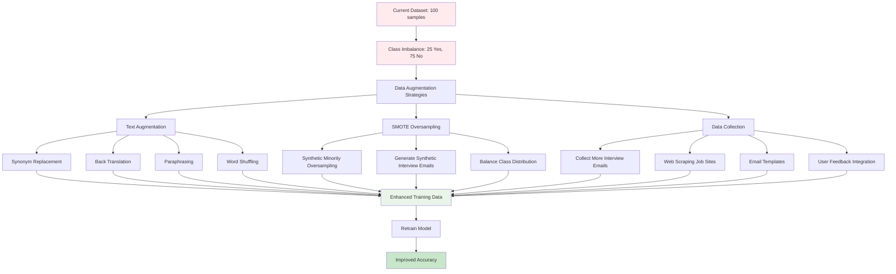

# Email Interview Classification Service

A FastAPI service that classifies emails to determine if they are interview-related or not using machine learning.

## Quick Start

### 1. Install Dependencies
```bash
python3 -m venv venv
source venv/bin/activate  # macOS/Linux
pip install -r requirements.txt
```

### 2. Download NLTK Data
```bash
python scripts/download_nltk_data.py
```

### 3. Train Model
```bash
python scripts/train.py data/Interview_vs_Non-Interview_Training_Emails__100_rows_.csv
```

### 4. Start REST API
```bash
python -m uvicorn app.main:app --host 0.0.0.0 --port 8000
```

### 5. Test API
```bash
curl -X POST "http://localhost:8000/v1/predict" \
     -H "Content-Type: application/json" \
     -d '{"email_body": "We would like to schedule a phone interview with you"}'
```

Expected response:
```json
{
  "is_interview": "Yes",
  "confidence": 0.85
}
```


## Retrain with Different CSV

To retrain the model with a different CSV file:

```bash
python scripts/train.py path/to/your/new_dataset.csv
```

The CSV must have these columns:
- `Body`: Email content (string)
- `is_interview`: Label (Yes/No)

## Docker Usage

### Build and Run
```bash
docker build -t email-classifier .
docker run -p 8000:8000 email-classifier
```

### Using Docker Compose
```bash
docker-compose up --build
```

## API Documentation

- Swagger UI: `http://localhost:8000/docs`
- Health Check: `http://localhost:8000/health`

## Testing

Run the test script to verify everything works:
```bash
python scripts/test_api.py
```

## Project Structure

```
├── app/                    # FastAPI application
├── scripts/               # Training and testing scripts
├── data/                  # Training data
├── models/                # Trained models (generated)
├── tests/                 # Unit tests
├── Dockerfile             # Docker configuration
└── requirements.txt       # Python dependencies
```

## Training Workflow

### Training Flow

```mermaid
flowchart TD
    A[Start Training] --> B[Load CSV Data]
    B --> C[Validate Data Format]
    C --> D[Check Required Columns: Body, is_interview]
    D --> E[Remove Empty Values]
    E --> F[Preprocess Text Data]
    
    F --> G[TextPreprocessor]
    G --> H[Convert to Lowercase]
    H --> I[Remove Special Characters]
    I --> J[Remove Extra Whitespaces]
    J --> K[Convert Labels: Yes=1, No=0]
    
    K --> L[Split Data: Train/Test 80/20]
    L --> M[Create TF-IDF Vectorizer]
    M --> N[Configure Vectorizer Parameters]
    N --> O[max_features: 5000<br/>ngram_range: 1,2<br/>min_df: 2<br/>max_df: 0.95<br/>stop_words: english]
    
    O --> P[Fit Vectorizer on Training Data]
    P --> Q[Transform Training & Test Data]
    Q --> R{Use SMOTE?}
    
    R -->|Yes| S[Apply SMOTE Oversampling]
    R -->|No| T[Train Logistic Regression Model]
    S --> T
    
    T --> U[Model Configuration:<br/>class_weight: balanced<br/>max_iter: 1000<br/>C: 1.0]
    U --> V[Fit Model on Training Data]
    
    V --> W[Evaluate Model Performance]
    W --> X[Calculate Metrics:<br/>Accuracy, Precision, Recall, F1]
    X --> Y[Generate Confusion Matrix]
    Y --> Z[Perform 5-Fold Cross Validation]
    
    Z --> AA[Save Model & Metadata]
    AA --> BB[Save classifier.pkl]
    BB --> CC[Save vectorizer.pkl]
    CC --> DD[Save metadata.json]
    
    DD --> EE[Training Complete]
    
    style A fill:#e1f5fe
    style EE fill:#c8e6c9
    style T fill:#fff3e0
    style W fill:#f3e5f5
    style AA fill:#e8f5e8
```



### Data Augmentation Strategy


